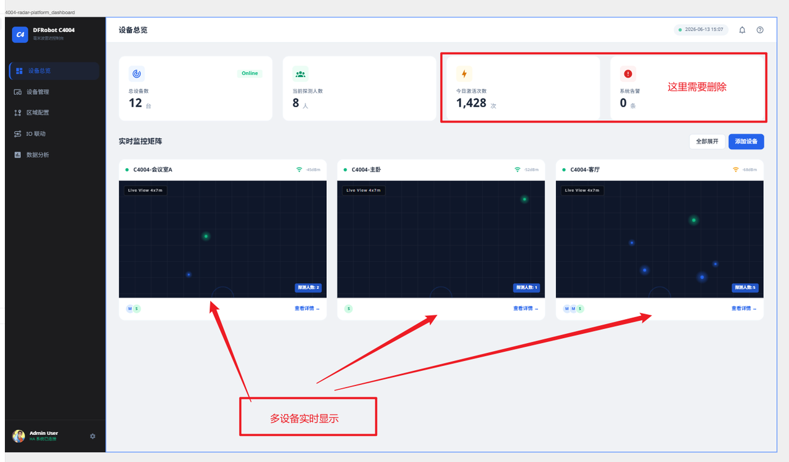
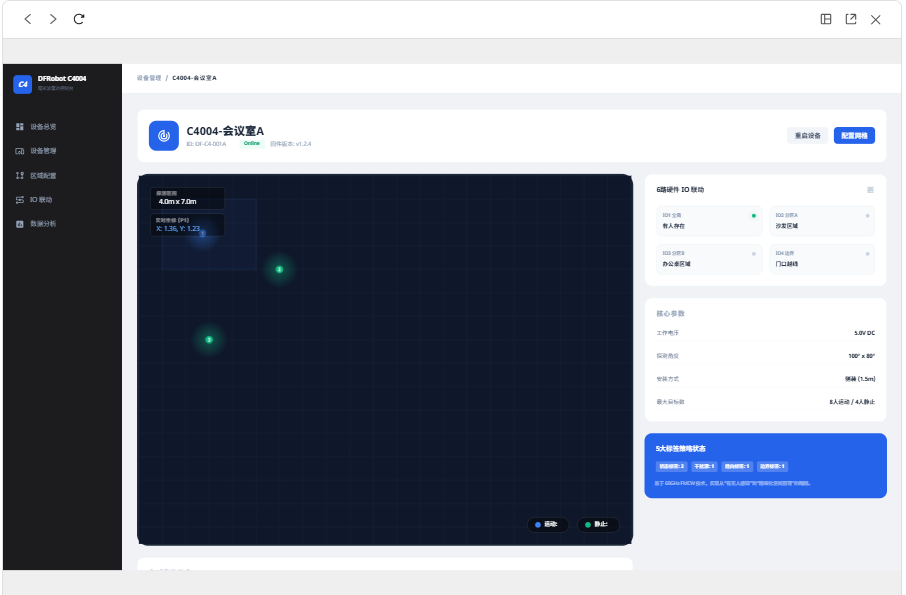
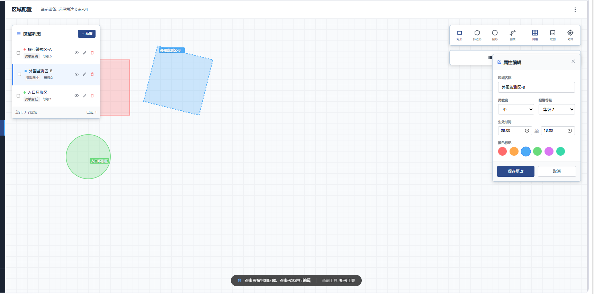

# DFRobot mmWave Add-ons

[![GitHub Stars][stars-shield]][repository] [![Latest Release][release-shield]][releases] [![Home Assistant][ha-shield]][ha-website]

## 关于本仓库

本仓库提供面向 DFRobot 毫米波传感器的 Home Assistant 插件，帮助用户在 Home Assistant 中完成设备发现、状态查看、参数配置、区域管理和实时目标可视化。

当前插件主要支持 DFRobot C4004，并为后续扩展更多 mmWave 设备型号预留了统一的设备配置框架。

## 安装插件仓库

此安装方式适用于支持插件（Add-ons）的 [Home Assistant OS][ha-installation]。如果使用 Home Assistant Container 等不支持插件的安装方式，则不能通过下面的方法安装。

### 一键添加

点击下面的按钮，在 Home Assistant 中添加本仓库：

[![打开 Home Assistant 并添加插件仓库][ha-repository-badge]][ha-repository-url]

### 手动添加

如果一键添加按钮无法使用：

1. 打开 Home Assistant，进入 **设置 → 插件 → 插件商店**。
2. 点击右上角的三点菜单，选择 **仓库**。
3. 输入以下仓库地址：

   ```text
   https://github.com/jiaziui/mmWave_addons
   ```

4. 点击 **添加**，然后关闭仓库窗口。
5. 在插件商店中找到 **DFRobot mmWave Add-ons**。
6. 选择 **DFRobot mmWave**，点击 **安装**。

## 本仓库提供的插件

### DFRobot mmWave

DFRobot mmWave 是一款面向毫米波传感器的可视化管理工具，可在 Home Assistant 中集中管理多台设备。

主要功能：

- 发现并管理 Home Assistant 中的 C4004 设备
- 查看设备在线状态、部署位置和安装参数
- 查看设备总数、人数、运动人数和静止人数
- 通过雷达坐标视图实时显示目标位置和运动轨迹
- 配置四边形或自定义多边形检测范围
- 创建并管理状态、边界、趋近/远离等检测区域
- 导入和导出检测范围及区域配置
- 查看区域事件日志和历史记录
- 为不同设备配置独立的底图、区域和参数
- 通过 MQTT 获取实时轨迹数据；未配置 MQTT 时仍可使用基础功能

有关安装、参数和使用方法，请参阅：

- [插件使用文档][addon-docs]
- [插件说明][addon-readme]
- [版本更新记录][changelog]

## 界面预览

### 设备总览



### 设备详情



### 区域管理



## 兼容性

- Home Assistant OS
- CPU 架构：`amd64`、`aarch64`、`armv7`
- 当前主要设备型号：DFRobot C4004
- MQTT：可选，用于实时轨迹数据

## 数据存储

插件按设备独立保存配置、检测区域、底图布局和事件日志。实时轨迹等高频数据仅保存在内存中，不写入持久化文件。

默认数据目录：

```text
/homeassistant/dfrobot_mmwave
```

卸载插件或清理 Home Assistant 配置前，建议先备份需要保留的设备配置和日志。

## 问题反馈

如果遇到安装、设备发现或功能异常，请在提交问题前准备以下信息：

- Home Assistant 和插件版本
- 运行设备的 CPU 架构
- C4004 固件及接入方式
- 插件日志中的相关错误信息
- 可复现问题的操作步骤

可通过 [GitHub Issues][issues] 提交反馈。

## 相关链接

- [DFRobot 官方网站][dfrobot]
- [Home Assistant 安装说明][ha-installation]
- [Home Assistant 插件说明][ha-addons]

<!-- Link definitions -->

[repository]: https://github.com/jiaziui/mmWave_addons
[releases]: https://github.com/jiaziui/mmWave_addons/releases
[issues]: https://github.com/jiaziui/mmWave_addons/issues
[stars-shield]: https://img.shields.io/github/stars/jiaziui/mmWave_addons
[release-shield]: https://img.shields.io/github/v/release/jiaziui/mmWave_addons
[ha-shield]: https://img.shields.io/badge/Home%20Assistant-Add--on-41BDF5?logo=homeassistant&logoColor=white
[ha-website]: https://www.home-assistant.io/
[ha-installation]: https://www.home-assistant.io/installation/
[ha-addons]: https://www.home-assistant.io/addons/
[ha-repository-badge]: https://my.home-assistant.io/badges/supervisor_store.svg
[ha-repository-url]: https://my.home-assistant.io/redirect/supervisor_add_addon_repository/?repository_url=https://github.com/jiaziui/mmWave_addons
[addon-docs]: dfrobot_mmWave/DOCS.md
[addon-readme]: dfrobot_mmWave/README.md
[changelog]: dfrobot_mmWave/CHANGELOG.md
[dfrobot]: https://www.dfrobot.com/
