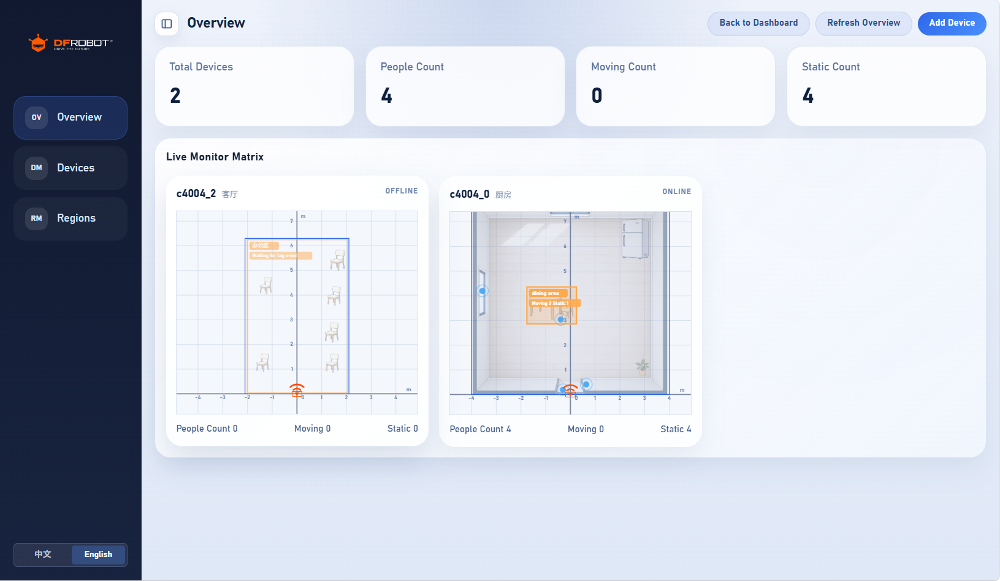
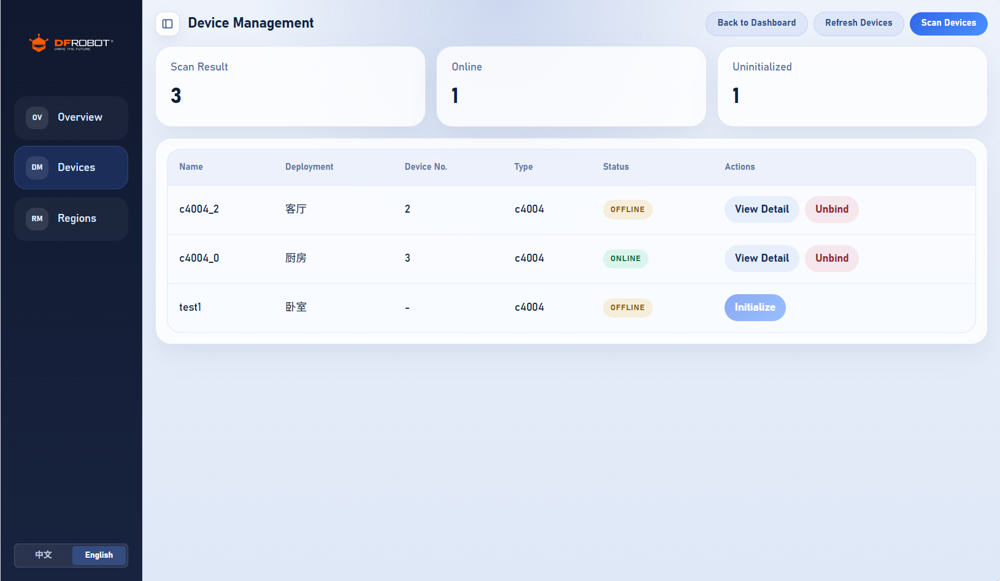
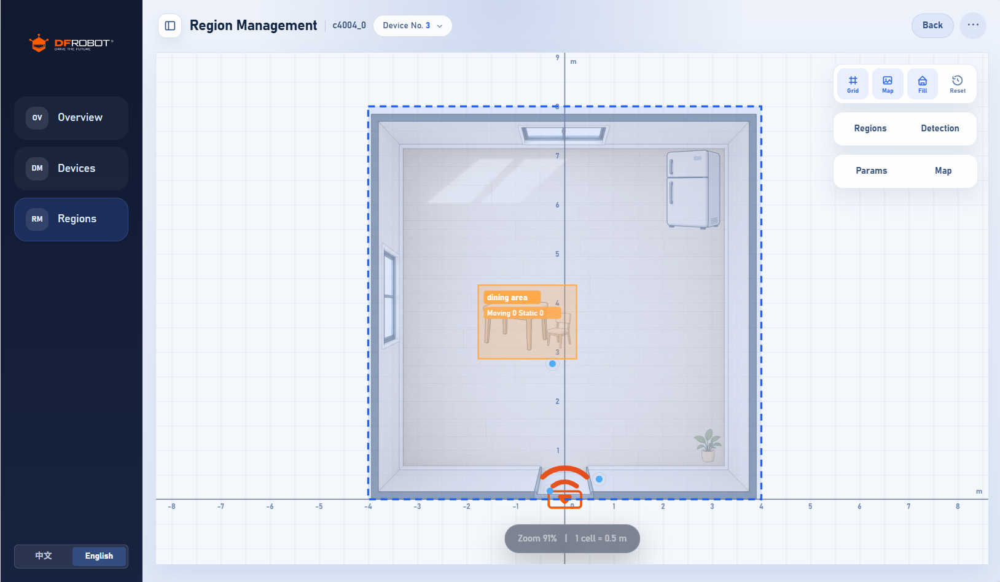

# DFRobot mmWave Add-ons

[![GitHub Stars][stars-shield]][repository] [![Latest Release][release-shield]][releases] [![Home Assistant][ha-shield]][ha-website]

[English](README.md) | **中文**

面向 DFRobot 毫米波传感器的 Home Assistant **插件仓库**。主插件是一套 Web 控制台，用于发现设备、查看实时状态、配置探测范围与标签区域、管理底图，以及查看事件日志。当前支持 **DFRobot C4004**。

---

## 使用要求

- [Home Assistant OS][ha-installation]（或其它带 Supervisor、支持插件的安装方式）。无 Supervisor 的 Home Assistant Container **不能**按本方式安装插件仓库。
- C4004 已烧录 ESPHome 组件 `dfrobot_c4004`，并通过 **ESPHome** 集成接入（Native API 实体）。
- **MQTT**（可选，建议开启）：实时轨迹与标签事件。未配置 MQTT 时，控制台仍可基于 HA 实体与本地已存配置降级运行。

固件 / 地图卡片相关文档见：[Home_Assistant_C4004](https://github.com/cdjq/Home_Assistant_C4004)（[英文 README](https://github.com/cdjq/Home_Assistant_C4004/blob/main/README.md) / [中文 README](https://github.com/cdjq/Home_Assistant_C4004/blob/main/README_CN.md)）。

---

## 安装插件仓库

### 一键添加

[![打开 Home Assistant 并添加插件仓库][ha-repository-badge]][ha-repository-url]

### 手动添加

1. 打开 Home Assistant → **设置 → 插件 → 插件商店**。
2. 右上角三点菜单 → **仓库**。
3. 添加：

   ```text
   https://github.com/jiaziui/mmWave_addons
   ```

4. 关闭对话框，找到 **DFRobot mmWave**，点击 **安装**。
5. 按需配置选项（见下文），**启动**插件，通过侧边栏面板或 Ingress 打开界面。

---

## 插件：DFRobot mmWave

面向 Home Assistant 的多设备毫米波管理控制台。

### 功能

- 从 Home Assistant 发现并绑定 C4004 设备
- 总览指标：设备数、人数、运动 / 静止人数
- 设备详情：安装信息、参数、软复位
- 雷达画布：实时目标（MQTT）、探测范围、标签区域
- 探测范围：四方矩形、自定义多边形、学习轨迹
- 标签区域：状态 / 边界 / 趋近远离
- 导入 / 导出自定义范围与区域配置
- 按设备管理底图（系统图 + 用户上传）；布局经 MQTT 同步到 **mmWave Map**
- 区域事件日志与保留策略
- 软复位与恢复出厂（出厂后刷新参数、清空本地标签区域、保留底图）
- 无 MQTT 时仍可用实体与本地配置；有 MQTT 时可看实时轨迹与标签事件

### 插件选项

| 选项 | 默认值 | 说明 |
|------|--------|------|
| `port` | `42069` | Web 服务端口（优先用 Ingress） |
| `mqtt_host` | _(空)_ | Broker 地址；留空则关闭 MQTT 实时模式 |
| `mqtt_port` | `1883` | Broker 端口 |
| `mqtt_username` | _(空)_ | 可选 |
| `mqtt_password` | _(空)_ | 可选 |
| `mqtt_client_id` | `dfrobot-mmwave-addon` | MQTT 客户端 ID |

配置 MQTT 后，后端会订阅设备 bridge 主题（轨迹、标签事件等）。未配置时仍可读 HA 实体与本地配置，但不显示实时目标点。

各设备固件中的 `mqtt_bridge.topic_prefix` 须与烧录配置一致（见 C4004 ESPHome 文档）。

### 插件内文档

| 文档 | 内容 |
|------|------|
| [dfrobot_mmWave/DOCS.md](dfrobot_mmWave/DOCS.md) | 安装、选项与行为说明 |
| [dfrobot_mmWave/README.md](dfrobot_mmWave/README.md) | 插件商店简介 |
| [dfrobot_mmWave/CHANGELOG.md](dfrobot_mmWave/CHANGELOG.md) | 版本记录 |
| [backend/README.md](dfrobot_mmWave/backend/README.md) | 后端架构、存储、API、设备型号接入 |

---

## 界面预览

### 设备总览



### 设备管理



### 区域管理



---

## 兼容性

- Home Assistant OS（Supervisor）
- CPU 架构：`amd64`、`aarch64`、`armv7`
- 主要设备：DFRobot C4004
- MQTT：可选，用于实时轨迹 / 标签配置 / 标签事件

---

## 问题反馈

提交 Issue 时请尽量附上：

- Home Assistant 与插件版本
- CPU 架构
- C4004 固件 / ESPHome 接入方式
- 相关插件日志
- 复现步骤

请使用 [GitHub Issues][issues]。

---

## 相关链接

- [DFRobot][dfrobot]
- [Home Assistant 安装说明][ha-installation]
- [Home Assistant 插件说明][ha-addons]
- [C4004 ESPHome + mmWave Map（中文）](https://github.com/cdjq/Home_Assistant_C4004/blob/main/README_CN.md)

<!-- Link definitions -->

[repository]: https://github.com/jiaziui/mmWave_addons
[releases]: https://github.com/jiaziui/mmWave_addons/releases
[issues]: https://github.com/jiaziui/mmWave_addons/issues
[stars-shield]: https://img.shields.io/github/stars/jiaziui/mmWave_addons
[release-shield]: https://img.shields.io/github/v/release/jiaziui/mmWave_addons
[ha-shield]: https://img.shields.io/badge/Home%20Assistant-Add--on-41BDF5?logo=homeassistant&logoColor=white
[ha-website]: https://www.home-assistant.io/
[ha-installation]: https://www.home-assistant.io/installation/
[ha-addons]: https://www.home-assistant.io/addons/
[ha-repository-badge]: https://my.home-assistant.io/badges/supervisor_store.svg
[ha-repository-url]: https://my.home-assistant.io/redirect/supervisor_add_addon_repository/?repository_url=https://github.com/jiaziui/mmWave_addons
[dfrobot]: https://www.dfrobot.com/
